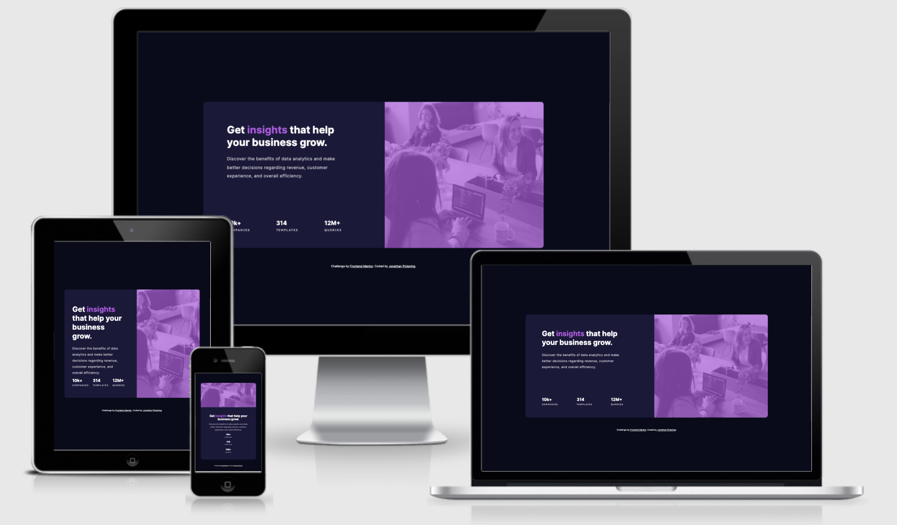

# Frontend Mentor - Stats preview card component solution

This is a solution to the [Stats preview card component challenge on Frontend Mentor](https://www.frontendmentor.io/challenges/stats-preview-card-component-8JqbgoU62). Frontend Mentor challenges help you improve your coding skills by building realistic projects.

## Overview

### The challenge

Users should be able to:

- View the optimal layout depending on their device's screen size

### Screenshot

### Links

- [Click Here for Live Site](https://jjpickering10.github.io/Frontend-Mentor-stats-preview-card/)

## My process

### Built with

- HTML
- CSS
- Flexbox

### What I learned

Using vh and vw for fonts is helpful.

### Continued development

Will continue to work through frontendmentor challenges.

## Author

- Frontend Mentor - [@jjpickering10](https://www.frontendmentor.io/profile/jjpickering10)
